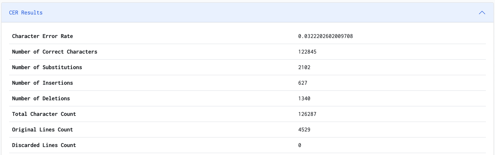
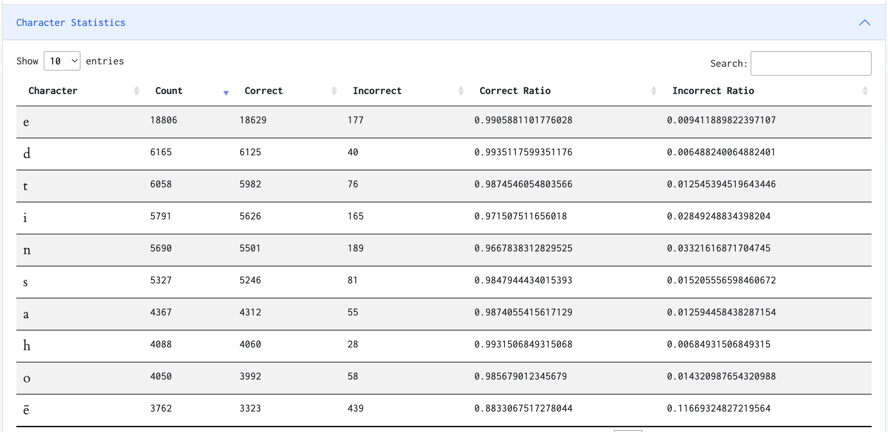
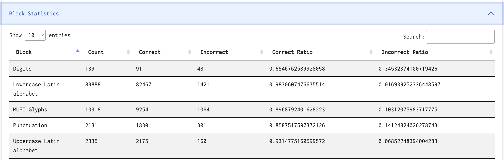
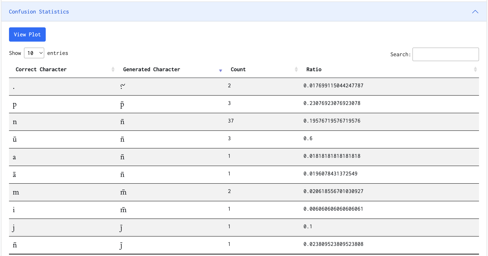
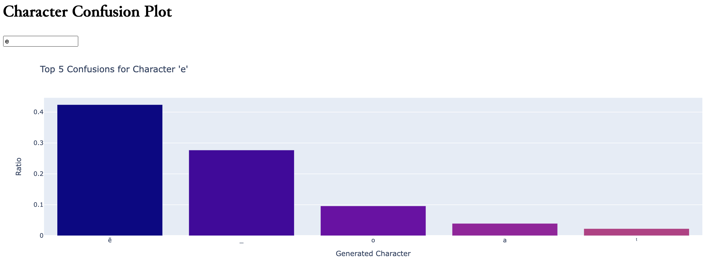

# CERberus -- guardian against character errors :dog::dog::dog:


Much like the mythical three-headed dog that guards the gates of the Underworld, **CERberus** ("ser-ber-us") serves as your loyal watchdog for the inspection of mistakes made by any kind of Handwritten Text Recognition tool, such as [Transkribus](https://readcoop.eu/transkribus/), or [eScriptorium](https://gitlab.com/scripta/escriptorium).

This module (that you can conveniently run in your web browser) provides an implementation of Character Error Rate (CER) calculation between a reference string and a hypothesis string, with various **customization options** available for pre-processing the strings and detailed reporting of results. It allows you to set specific options such as ignoring case, punctuation, whitespaces, numbers, newlines and returns, and other specific characters.

## Installation & Setup

To clone and run this application, you'll need [Git](https://git-scm.com/), [Python](https://www.python.org/downloads/), and [Anaconda](https://www.anaconda.com/products/distribution) (or [Miniconda](https://docs.conda.io/en/latest/miniconda.html)) installed on your computer. You will also need to install some Python packages to run this application. From your command line, run:

```bash
# Clone this repository
git clone https://github.com/WHaverals/CERberus.git

# Go into the repository
cd CERberus

# Create a dedicated Conda environment
conda create --name cerberus python=3.9.15

# Activate the Conda environment
conda activate cerberus

# Install dependencies
pip install -r requirements.txt
```
After this, you can run the application using the following command:

```bash
python app.py
```

Remember to make sure your `CERberus` Conda environment is activated when you run this app. If it's not, you can activate it with `conda activate CERberus`.

Navigate to [http://127.0.0.1:5000](http://127.0.0.1:5000/) (or, possibly, another address that is printed to your console) to view the application in your web browser.

## Features


-  **Reference Text:** This is the correct, or "gold standard" text. You can paste the reference text directly into the form, or drop a `.txt` file into the provided area.
    
- **Hypothesis Text:** This is the text that you want to compare to the reference text. Like the reference text, you can paste the hypothesis text directly into the form, or drop a `.txt` file into the provided area.
    
-  **Options and Ignore Characters:** CERberus provides several options to tailor the comparison to your specific needs, including the ability to ignore:
    
    -   **Punctuation**: All punctuation marks are removed from both texts.
    -   **Case**: Case differences between the two texts are ignored by converting both texts to lowercase.
    -   **Whitespace**: All whitespace characters (spaces, tabs, line breaks) are removed from both texts.
    -   **Numbers**: All numeric characters (`0-9`) are removed from both texts.
    -   **Newlines**: Newline (`\n`) and carriage return (`\r`) characters are removed from both texts.
    
    In addition to these options, you can specify characters to ignore, characters to discard lines, and replacement characters.
    
-  **CER for Unicode Ranges and/or Custom Ranges:** CERberus allows you to calculate CER for specific Unicode ranges such as Lowercase Latin alphabet, Uppercase Latin alphabet, Digits, Punctuation, MUFI Glyphs. You can also define custom ranges for CER calculation. A useful website in this case is [Unicode Lookup](https://unicodelookup.com/), a search engine dedicated to Unicode characters. You can search by hexadecimal, decimal, or octal code point, as well as by character name or category.

## Results

CERberus displays the results of its analysis in a variety of ways to provide detailed insight into the character error rate and related metrics. Here is an overview of the different sections available on the results page.

### CER Results



-   **Character Error Rate (CER)**: The main result, which measures the total number of character errors (insertions, deletions, and substitutions) divided by the total number of characters in the reference.
    
-   **Number of Correct Characters**: The total number of characters that have been correctly predicted by the model.
    
-   **Number of Substitutions**: The total number of characters that should be substituted in the hypothesis to match the reference string.
    
-   **Number of Insertions**: The total number of characters that should be inserted into the hypothesis to match the reference string.
    
-   **Number of Deletions**: The total number of characters that should be deleted from the hypothesis to match the reference string.

-   **Total Character Count**: The total number of characters in the reference text.
    
-   **Original Lines Count**: The number of lines in the original document.
    
-   **Discarded Lines Count**: The number of lines discarded during the analysis.


### Character Statistics

The Character Statistics table provides a detailed analysis of each character in the evaluation text. It gives an understanding of how accurately the model is predicting each character. Here's an example of what the table looks like:




-   **Character**: The individual character evaluated from the text.
-   **Count**: The total number of occurrences of this character in the reference text.
-   **Correct**: The number of times the model correctly predicted this character.
-   **Incorrect**: The number of times the model incorrectly predicted this character.
-   **Correct Ratio**: The proportion of correct predictions out of total occurrences (`Correct / Count`).
-   **Incorrect Ratio**: The proportion of incorrect predictions out of total occurrences (`Incorrect / Count`).

### Block Statistics

The Block Statistics section provides detailed performance metrics for each Unicode block encountered in the evaluation text. It helps to understand how well the model is predicting characters within each Unicode block. Here's an example of what the table might look like:




-   **Block**: The Unicode block of the characters.
-   **Count**: The total number of occurrences of characters from this block in the reference text.
-   **Correct**: The number of times characters from this block were correctly predicted by the model.
-   **Incorrect**: The number of times characters from this block were incorrectly predicted by the model.
-   **Correct Ratio**: The proportion of correct predictions out of total occurrences (`Correct / Count`).
-   **Incorrect Ratio**: The proportion of incorrect predictions out of total occurrences (`Incorrect / Count`).

### Confusion Statistics

The Confusion Statistics section provides a deeper understanding of the confusions between different characters. For each pair of confused characters, the following metrics are provided:



-   **Correct Character**: The character that should have been predicted.
-   **Generated Character**: The character that was actually predicted by the model.
-   **Count**: The total number of times this confusion occurred.
-   **Ratio**: The ratio of this confusion to the total number of character predictions.

To provide a more visual representation of the confusion statistics, a link is provided to a plot which can help to identify the most common character confusions.



### Cite

If you find CERberus helpful in your research, please consider citing it in your work:

Haverals, Wouter. "CERberus: Guardian Against Character Errors." 2023, v1.0, https://github.com/WHaverals/CERberus.

 Here is the citation in BibTeX format: 

```bash
@misc{haverals2023cerberus,
title={CERberus: guardian against character errors},
author={Wouter Haverals}, 
year={2023},
version={1.0},
url={https://github.com/WHaverals/CERberus}}
```
----